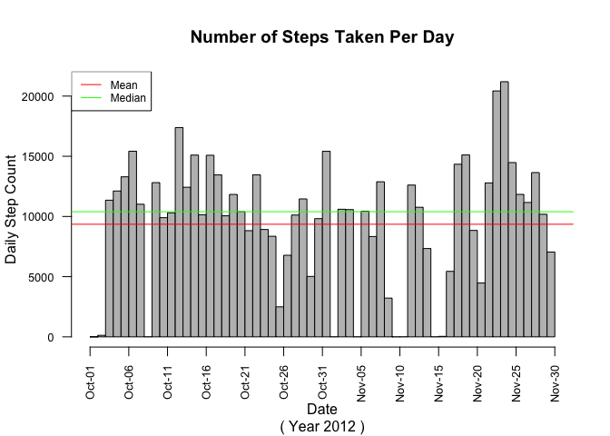
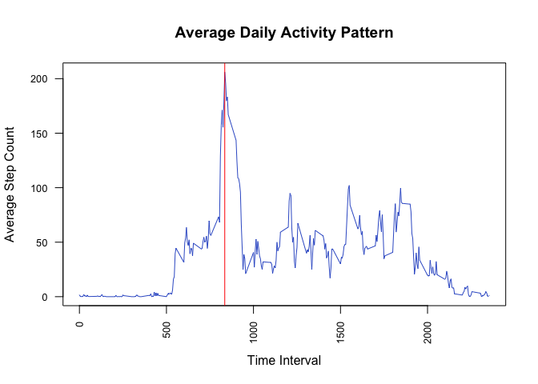
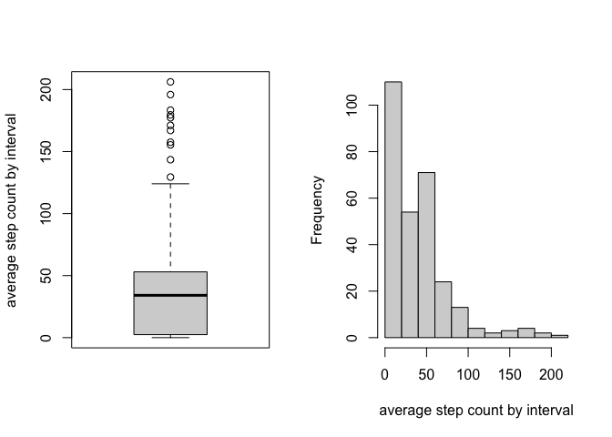
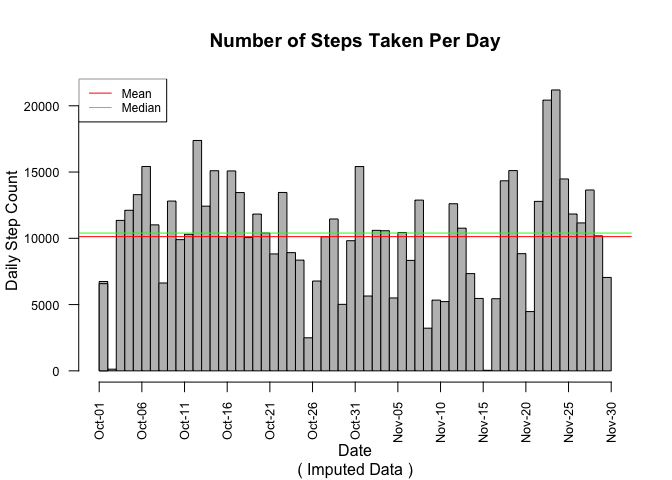
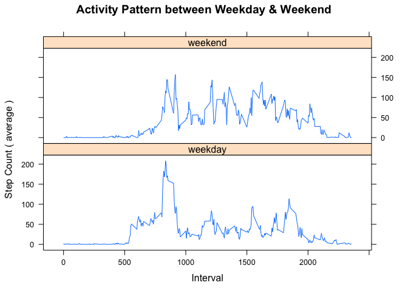

```r
knitr::opts_chunk$set(echo = TRUE)
Sys.setenv(TZ = "UTC")      # set global TZ for POSIXt class
.Rfliburl <- "https://raw.githubusercontent.com/robertwcw/Rflib/master"
source(file.path(.Rfliburl,"getRflib.R"),local = TRUE)
source(getRflib("is.defined.R"),local = TRUE)
source(getRflib("myplclust.R"),local = TRUE)
source(getRflib("strCap.R"),local = TRUE)
library(dplyr, warn.conflicts = TRUE, quietly = TRUE)
library(lubridate, warn.conflicts = TRUE, quietly = TRUE)
library(scales, warn.conflicts = TRUE, quietly = TRUE)
```
&nbsp;

## Introduction

This assignment makes use of the data collected from a personal activity monitoring device strapped to the waist, captures data at 5 minute intervals through out the day on the number of steps taken by an anonymous individual in daily activities during the months of November and October in 2012. The device that was used to capture the steps data is part of the “quantified self” movement – a group of enthusiasts who take measurements about themselves regularly to improve their health, to find patterns in their behavior, or because they are tech geeks. 

The data set in CSV format is available here: [Activity monitoring data](https://d396qusza40orc.cloudfront.net/repdata%2Fdata%2Factivity.zip).

Each row in the data set consists of three variables recorded the total number of steps taken in daily activities in every 5 minutes interval spanned across 24 hours each day for two consecutive months. The context of the steps taken in daily activities is referring to the body movements like walking (include up/down stairs), running or jumping.

The variables found in the data set are:  
1. **steps**: Number of steps taken by the anonymous individual in 5-minute interval.  
2. **date**: The date (YYYY-MM-DD) which the measurements were taken.  
3. **interval**: Identifier for the 5-minute interval for which the observation was captured.  
&nbsp;

### Loading and Preprocessing Data

1. download data set and unzip to designated directory.  
2. take-a-peek at the unzipped data set to determine number of files, file type, data format and the presence of header...etc, to determine the  appropriate technique to process the 'raw' data into analytic data for downstream analysis.

<!-- as.list(unzip(filetmp, list = TRUE)) #get a list of file names -->
<!-- length(filels$Name) #display number of files in the zip file -->
<!-- filels$Name #display file name & file type. -->
<!-- filels$Length #display physical file size -->
<!-- readLines(filels$Name[i], n = 5) #display first 5 lines. (text-file only) -->
<!-- length(readLines(filels$Name[i])) - 1 #display row count (text-file only) -->

<!-- download data set from internet source and load into R environment -->

```r
filetmp <- tempfile()
datadir <- paste(".", "data", sep = "/")
fileurl <- "https://d396qusza40orc.cloudfront.net/repdata%2Fdata%2Factivity.zip"
download.file(fileurl, filetmp)

if (!dir.exists(datadir)) 
    {
        dir.create(datadir)
    }

unzip(filetmp, exdir = datadir, overwrite = TRUE)
filels <- as.list(unzip(filetmp, list = TRUE))
filein <- as.character()
filesrc <- as.character()

for (i in 1:length(filels$Name)) 
    {
        filesrc <- paste(datadir, filels$Name[[i]], sep = "/")
        filein <- strsplit(filels$Name[[i]], ".", fixed = TRUE)[[1]][1]
        assign(filein, read.csv(filesrc))
    }

unlink(filetmp)
rm(filetmp, fileurl, filein, filesrc, i)
```

One data set named **activity** was extracted from the downloaded zip file and loaded into R.  

Structure of **activity** data set:

```r
str(activity)
```

```
## 'data.frame':	17568 obs. of  3 variables:
##  $ steps   : int  NA NA NA NA NA NA NA NA NA NA ...
##  $ date    : chr  "2012-10-01" "2012-10-01" "2012-10-01" "2012-10-01" ...
##  $ interval: int  0 5 10 15 20 25 30 35 40 45 ...
```

* **activity** variable data type.
  + **steps**: integer class.
  + **date**: character class.
  + **interval**: integer class.
  
Take note that the variable **date** shall belonged to the date class data type instead of the current character class data type in  which date values are stored as character string. Time-series related analysis requires that the **date** variable be transformed into formal date class vector to warrant proper analysis.
&nbsp;

*5-numbers summary*

```r
summary(activity)
```

```
##      steps            date              interval     
##  Min.   :  0.00   Length:17568       Min.   :   0.0  
##  1st Qu.:  0.00   Class :character   1st Qu.: 588.8  
##  Median :  0.00   Mode  :character   Median :1177.5  
##  Mean   : 37.38                      Mean   :1177.5  
##  3rd Qu.: 12.00                      3rd Qu.:1766.2  
##  Max.   :806.00                      Max.   :2355.0  
##  NA's   :2304
```
&nbsp;
*Missing value distribution*

```r
colMeans(is.na(activity))
```

```
##     steps      date  interval 
## 0.1311475 0.0000000 0.0000000
```
<!-- workout the sum and mean of missing values for each column variable -->


The 5-numbers summary of **activity** data set shows there are 2304 missing values (coded as NA), representing approx. 13% missing values present in the data set. The ratio of missing values considered significant in this case which can skewed the outcomes of downstream analysis.

Missing value distribution, not in the usual sense of statistical distribution, simply reveals how the missing values are scattered within the data set.  
- **steps**: contains 13% missing value.  
- **date**: 0%.  
- **interval**: 0%.  

<!-- pre-processing data set  -->

```r
# Pre-processing data for downstream analysis

names(activity) <- strCap(names(activity))  # capitalize variable names.

# hr <- activity$Interval %/% 100 # e.g. 2355 gives 23
# mn <- activity$Interval %% 100 # e.g 2355 gives 55

# transform Date variable to 'date' class and add Time variable of POSIXt
time.hms <- substr(as.POSIXct(sprintf("%04.0f", activity$Interval), format = '%H%M'), 12, 19)
date.time <- as.POSIXct(paste(activity$Date, time.hms))
activity <- activity %>%
            mutate(Date = as.Date(Date), Time = date.time) %>%
            arrange(Time)

# create daily activity summary
actsum <- activity %>% 
                select(Date, Steps) %>%
                mutate(Mean = as.numeric(0),
                       Median = as.numeric(0)) %>%
              group_by(Date) %>% 
             summarise(Mean = mean(Steps, na.rm = TRUE),
                       Median = median(Steps, na.rm = TRUE),
                       Steps = sum(Steps, na.rm = TRUE))

rm(time.hms, date.time)
```
&nbsp;

### What is mean total number of steps taken per day?

There are some missing column-bars *( for dates Oct-01, Oct-08, Nov-01, Nov-04, Nov-09, Nov-10, Nov-14 and Nov-30 )* in the histogram due to the presence of missing values in the data set as mentioned.
<!-- histogram for Total Number of Steps Taken Per Day using base graphic -->

```r
h <- hist(actsum$Date, breaks = "days", freq = FALSE, plot = FALSE)
h$counts <- actsum$Steps

par(cex.axis = 0.8, las = 2)
plot(h, xaxt = "n", ann = FALSE, col = "grey")
axis(1, at = seq(h$breaks[1], h$breaks[length(h$breaks)], by = 5), 
     labels = c(format(as.Date(seq(h$breaks[1], h$breaks[length(h$breaks)], 
                                   by = 5 ), origin = "1970-01-01"), "%b-%d")))
abline(h = mean(actsum$Steps), col = "red")
abline(h = median(actsum$Steps), col = "green")
legend("topleft", legend = c("Mean", "Median"), 
       lty = c(1,1,1), col = c("red","green"), cex = 0.75)
title(main = "Number of Steps Taken Per Day", 
      sub = "( Year 2012 )",
      xlab = "Date", 
      ylab = "Daily Step Count",
      cex = 1)
```

<!-- -->
<!-- histogram for Total Number of Steps Taken Per Day using ggplot2 graphic -->
<!-- NOT USE & HIDDEN FROM FINAL OUTPUT -->


The total number of steps taken per day by the anonymous are illustrated in the histogram, where each bar in the graph represents the total step count recorded each day. The mean and median of the step count observations accumulated over the two months period as portrayed by the visual representation of the red and green horizontal lines overlaid on the histogram, hovering around the 10,000 mark indicate the anonymous individual performed, on average 9354.23 steps, close to 10,000 steps per day in daily activities. The median value 10395 hovering slightly above the 10,000 mark. However, the daily mean and daily median are about 1000 steps apart from each other or about 10% of the mean/median indicate there is some abnormality in the data set.  
&nbsp;

<!-- 
frequency param setting for ts()
interval	frequency
annually        1
quarterly       4
monthly        12
weekly         52
daily         365.25
the frequency is the number of observations per cycle (normally a year, a week, a day or an hour).

if the frequency of observation is greater than once in a day, then there is more than one way of handling the frequency. e.g. data with per minute observation might have an hourly seasonality (frequency = 1 x 60), a daily seasonality (frequency = 1 x 60 x 24), a weekly seasonality (frequency = 1 x 60 x 24 x 7) and an annual seasonality (frequency = 1 x 60 x 24 x 365.25).

i.e.    frequency determines the number of observations per cycle, and therefore the number of cycle (number of observations / frequency) in the time series.

start param setting for ts()
i.e. start(m,n) where m = the number of the first cycle 
                      n = the starting nth incident for that first cycle
end(m,n) where m = the number of the last cycle
               n = the ending nth incident for that last cycle
      
e.g.
ts(actsum, 
        start = c(year(min(actsum$Date)), yday(min(actsum$Date))),
        end = c(year(max(actsum$Date)), yday(max(actsum$Date))),
        frequency = 365)

ts(activity,
        start = c(1,1),
        end = c(17568/(12*24), 12*24),
        frequency = 12*24)
-->

### What is the Average Daily Activity Pattern?

<!-- Average Daily Activity Pattern plot using base graphic -->
<!-- Not Use and Hidden from  final output -->

<!-- Time-series plot for Average Daily Activity Pattern using base graphic  -->

```r
pal <- c(rgb(0,0,1), rgb(0,1,0), rgb(1,0,0), rgb(1,0,1), rgb(1,1,0), rgb(0,1,1))

activity.ts <- ts(aggregate(Steps ~ Interval, data = activity, FUN = mean))

par(cex.axis = 0.8, las = 2, ann = FALSE)
plot(activity.ts[,2] ~ activity.ts[,1], type = "l", col = "royalblue3")
h <- activity.ts[which(activity.ts[,2] == max(activity.ts[,2])),]
abline(v = h[1], col = pal[3])
title(main = "Average Daily Activity Pattern", 
      xlab = "Time Interval", 
      ylab = "Average Step Count",
      cex = 0.9,
      cex.sub = 0.7)
```

<!-- -->

The average daily activity pattern time-series plot shows the anonymous individual's daily activity pick up pace starting 0600 hour lasted for 13 hours, paces begin to wind-down from 1900 hour onward and gradually slow down to negligible level at around 2130 hour continuing forward. There is a noticeable sharp spike (red color vertical line) in the average activity at 0835 hour to 206.1698 steps, which is double the maximum average step count of 100 for most part of the day.
&nbsp;


```r
par(mfrow = c(1,2))
boxplot(activity.ts[,2], ylab = "average step count by interval")
hist(activity.ts[,2], main = NULL, xlab = "average step count by interval")
```

<!-- -->

As shown in the Boxplot (left) and histogram (right) above, least number of data point or lowest frequency beyond the average 200-step count mark affirmed the unusual sharp spike exhibited in the Average Daily Activity Pattern time series graph plot.  
&nbsp;

### Imputing Missing Values

As mentioned earlier, there are 2304 or 13% missing values (coded as NA) found in the **activity** data set. 

- **steps** variable: contains 13% missing value.  
- **date** variable: 0%.  
- **interval** variable: 0%.  

The present of missing values will induce biased analysis outcomes. Therefore K-Nearest Neighbour (knn) algorithm is employed to impute missing values in the data set, as knn imputation method is well accepted in the community among the practitioners.

<!-- 
Generally accepted approach to determine k-value for knn.impute() base on internet search.
k = sqrt(17568)/2 
where number of observations = 17568
-->
<!-- Imputing missing values in data set using knn.impute() -->

```r
# knn.impute() function
library(impute)

activity.imputed <- impute.knn(data.matrix(activity[,1:3]), k = 65)$data

activity.imputed <- as.data.frame(activity.imputed)
activity.imputed <- mutate(activity.imputed, Time = activity$Time)

# prepare daily summary of imputed activity data set
actsum <- activity.imputed %>% 
                select(Date, Steps) %>%
                mutate(Date = as_date(Date),
                       Mean = as.numeric(0),
                       Median = as.numeric(0)) %>%
              group_by(Date) %>% 
             summarise(Mean = mean(Steps),
                       Median = median(Steps),
                       Steps = sum(Steps))
```

5-numbers summary of imputed **activity** data set shows that missing values had been imputed with k-nearest neighbour data values.  


```r
summary(activity.imputed[1:3])
```

```
##      Steps             Date          Interval     
##  Min.   :  0.00   Min.   :15614   Min.   :   0.0  
##  1st Qu.:  0.00   1st Qu.:15629   1st Qu.: 588.8  
##  Median :  0.00   Median :15644   Median :1177.5  
##  Mean   : 35.16   Mean   :15644   Mean   :1177.5  
##  3rd Qu.: 18.00   3rd Qu.:15659   3rd Qu.:1766.2  
##  Max.   :806.00   Max.   :15674   Max.   :2355.0
```

```r
colMeans(is.na(activity.imputed[1:3]))
```

```
##    Steps     Date Interval 
##        0        0        0
```

<!-- Histogram of Total number of Steps per day from imputed data using base graphic -->

```r
h <- hist(actsum$Date, breaks = "days", freq = FALSE, plot = FALSE)
h$counts <- actsum$Steps

par(cex.axis = 0.8, las = 2)
plot(h, xaxt = "n", ann = FALSE, col = "grey")
axis(1, at = seq(h$breaks[1], h$breaks[length(h$breaks)], by = 5), 
     labels = c(format(as.Date(seq(h$breaks[1], h$breaks[length(h$breaks)], 
                                   by = 5 ), origin = "1970-01-01"), "%b-%d")))
abline(h = mean(actsum$Steps), col = "red")
abline(h = median(actsum$Steps), col = "green")
legend("topleft", legend = c("Mean", "Median"), 
       lty = c(1,1,1), col = c("red","green"), cex = 0.75)
title(main = "Number of Steps Taken Per Day", 
      sub = "( Imputed Data )",
      xlab = "Date", 
      ylab = "Daily Step Count",
      cex = 1)
```

<!-- -->

The histogram for **Number of Steps Taken Per Day** plotted using imputed *average daily activity data*, compared to the previous histogram of the same based on pre-imputed data, proximity of both the mean value 10126.67 and median value 10395.00 have become fairly close together as indicated by the red horizontal line and green horizontal line respectively. Note the mean line is now moved up the scale to above the 10000-step mark in contrast to the median line remain unchanged, the shift in central values to become much closer to each other explain the *average daily activity data* sorted by date in ascending order derived from the imputed data set had attained improved normal (symmetrical) distribution.  
&nbsp;  

### Are there differences in activity patterns between weekdays and weekends?

<!-- Activity Pattern between Weekday & Weekend plot using lattice graphic -->

```r
library(lattice)

dow <- if_else(wday(as_date(activity.imputed$Date)) 
               %in% c(7,1),"weekend","weekday")
activity.imputed <- activity.imputed %>% mutate(DoW = as.factor(dow))
rm(dow)

activity.imputed.ts <- activity.imputed %>%
                        group_by(DoW, Interval) %>%
                        summarise(Steps = mean(Steps))

xyplot(Steps ~ Interval | DoW, data = activity.imputed.ts, 
       layout = c(1,2),
       type = "l",
       main = "Activity Pattern between Weekday & Weekend",
       ylab = "Step Count ( average )")
```

<!-- -->

There are apparent differences observed in the time series plot for Weekend vs Weekday. The average activity paces are more intense overall across the weekends than weekdays where paces are more sedate comparatively except 0800 ~ 0900 hour. The anonymous individual tends to pick up paces later starting at 0800 ~ 0900 for the weekends as oppose to weekdays, and winding-down later than normally does during weekdays beginning at 2000 hour for the day during weekends.   
&nbsp;

<!-- ```{r house.keeping} -->
<!-- detach("package:ggplot2", unload = TRUE) -->
<!-- detach("package:dplyr", unload = TRUE) -->
<!-- detach("package:lattice", unload = TRUE) -->
<!-- detach("package:knn.impute", unload = TRUE) -->
<!-- detach("package:lubridate", unload = TRUE) -->
<!-- detach("package:lattice", unload = TRUE) -->
<!-- rm(.Rfliburl,getRflib,is.defined,myplclust,strCap) -->
<!-- rm(activity,activity.ts,activity.imputed,activity.imputed.ts,actsum) -->
<!-- rm(filels,gr0,h,datadir,na.count,na.ratio,pal) -->
<!-- ``` -->


